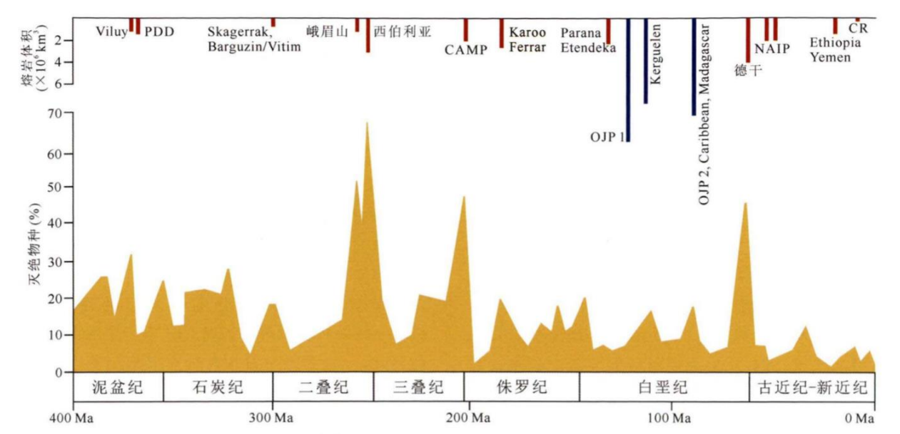
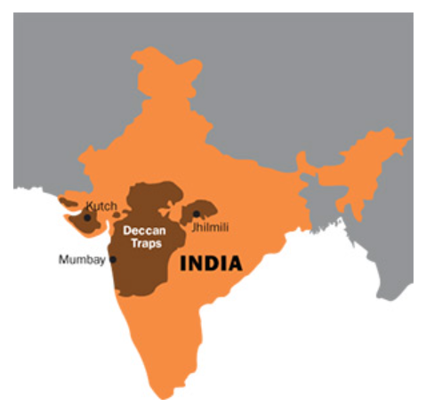
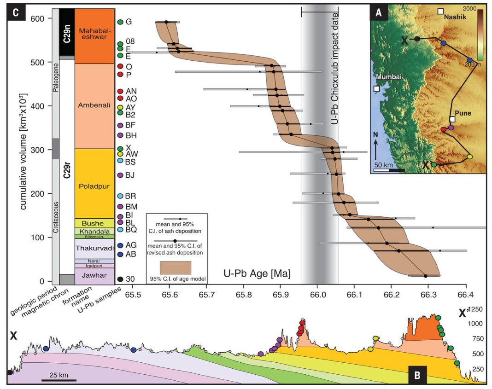
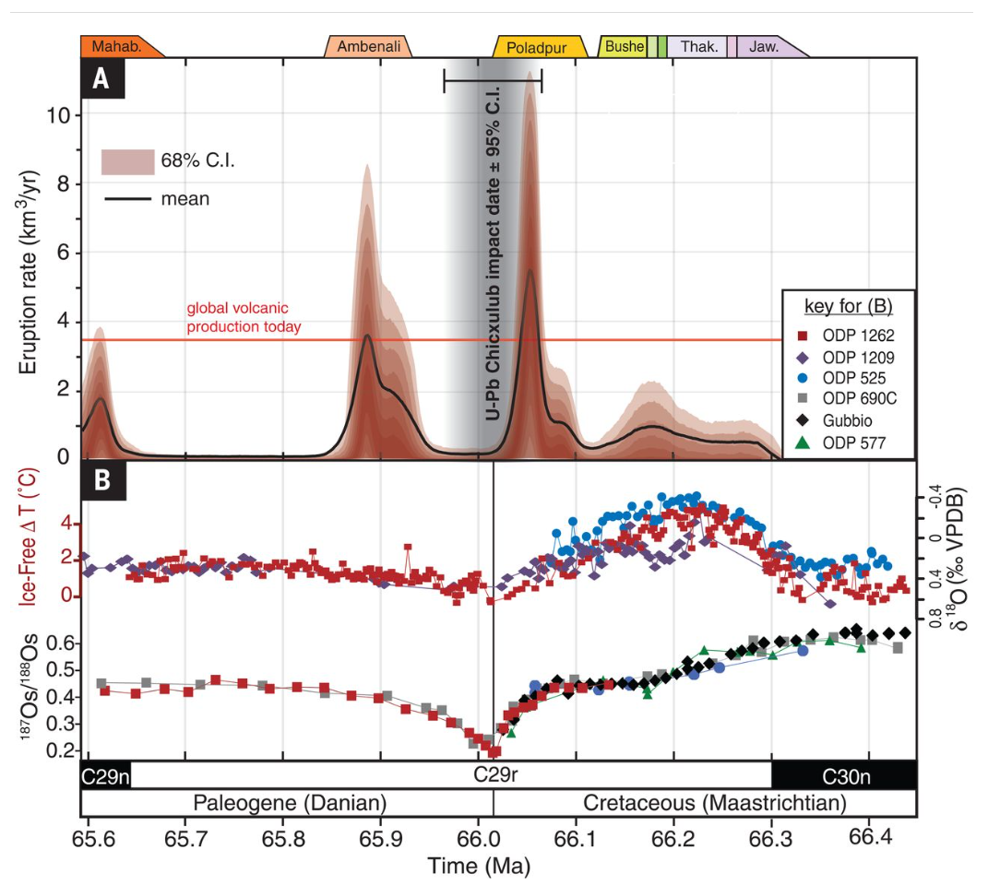
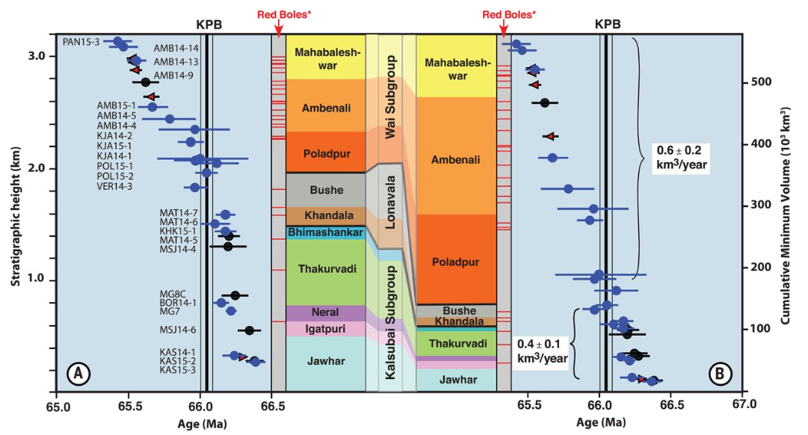

# 德干大火成岩省

&emsp;&emsp;地球上发生过多次生物灭绝事件，尽管生物灭绝的原因尚无定论，但在地质历史上多次生物大灭绝与大火成岩省火山活动在时间上有着巧合的对应关系.很多学者认为大火成岩省的火山活动在生物大灭绝起到了不可忽视的影响.鉴于二叠纪末西伯利亚大火成岩省对整个地球生态系统的巨大影响,很多科学家也都认为这次白垩纪末的生物大灭绝与和它基本上同时间发生的德干大火成岩省密切相关.

&emsp;&emsp;德干火山爆发所形成的熔岩地形，被估计最大面积为150万平方公里，相当于现在印度的一半面积，而后经由侵蚀作用与大陆漂移，形成现在的大小。目前所能直接观测的熔岩面积约为51.2万平方公里

400Ma以来的大火成岩省事件与生物灭绝事件的时间关系图

德干大火成岩省分布

主要争论点在于大火成岩省喷发的时间精度太低,无法判断是火山爆发造成大灭绝还是行星撞击造成的.所以近期关于德干火成岩省的研究大部分都是更高精度确定其喷发时间.

## Blair等人用铀铅（U-Pb）锆石来估计喷发年龄

取样地点

结果表明,德干火山在四次高容量事件中喷发，每次持续≤100 ka，间隔有相对火山静止期。第一次事件对应于~66.3至66.15 Ma前最下层的七个地层的喷发;第二个是~66.1至66.0 Ma前的Poladpur组;第三个是~65.9至65.8 Ma前的Ambenali组;第四个是最上层的Mahabaleshwar地层，从~65.6到65.5 Ma前。

他们采用的生物大灭绝的时间大概在66.016 ± 0.050 Ma.很显然,德干大火成岩省的喷发跨越了白垩纪末灭绝,也就是火山爆发是造成生物灭绝的主要原因.

## Courtney等人用斜长石中Ar同位素测年

40Ar/39Ar测定喷发年龄大概是从~66.413到~65.422 Ma前.
研究全部同意德干主要喷发期始于66.3Ma持续到65.5Ma（持续至少80万年）.也横跨了白垩纪末灭绝.

Referrence:
Blair Schoene et al. ,U-Pb constraints on pulsed eruption of the Deccan Traps across the end-Cretaceous mass extinction.Science363,862-866(2019).DOI:10.1126/science.aau2422
Courtney J. Sprain et al. ,The eruptive tempo of Deccan volcanism in relation to the Cretaceous-Paleogene boundary.Science363,866-870(2019).DOI:10.1126/science.aav1446
