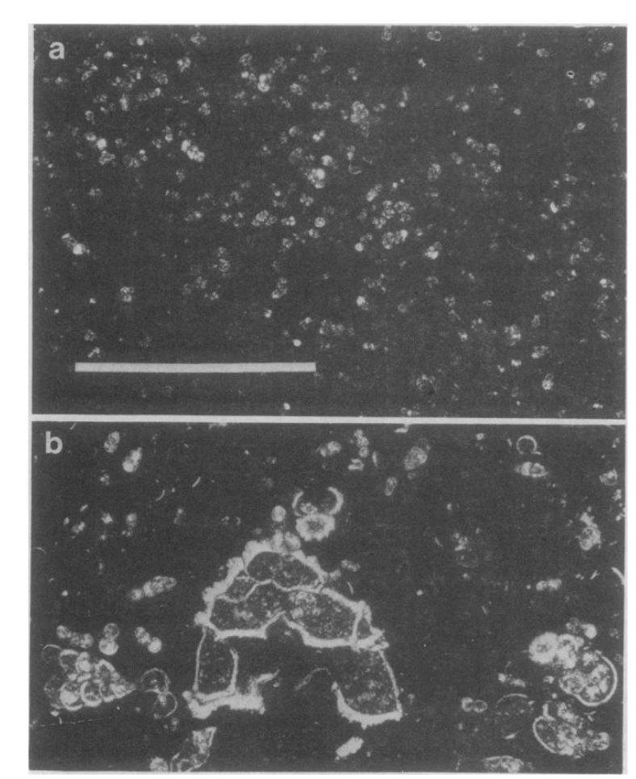
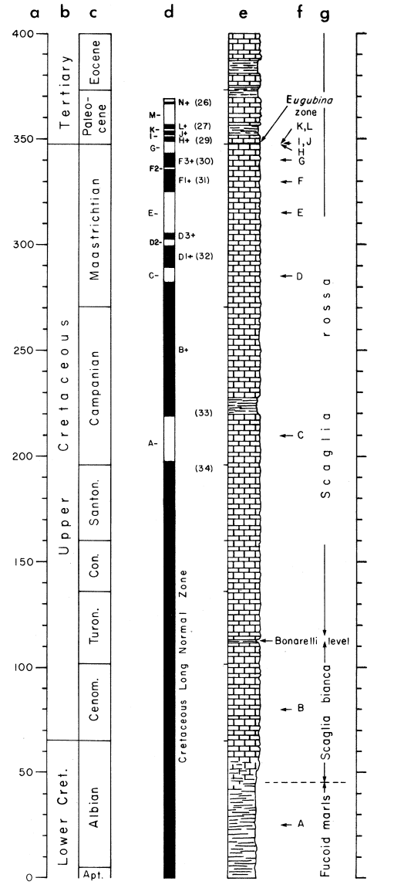
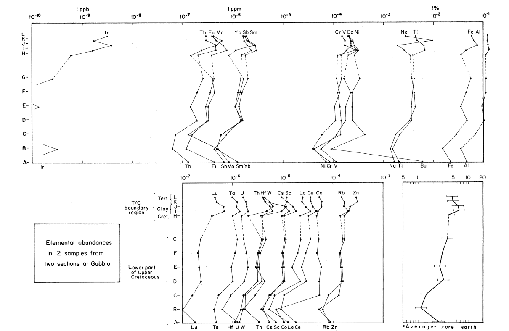
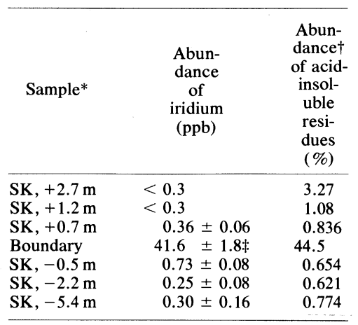
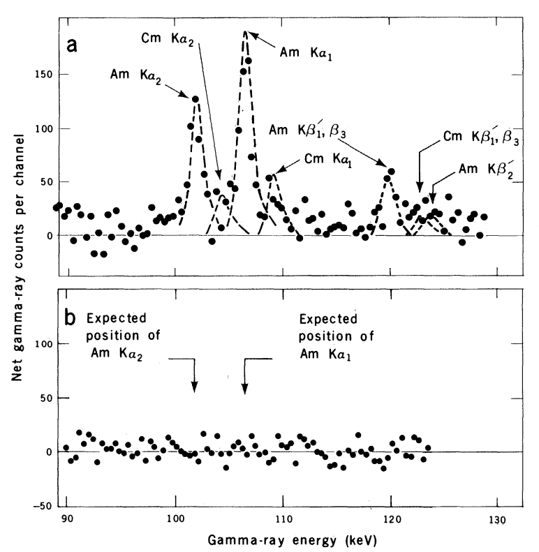

# 行星撞击

## Extraterrestrial Cause for the Cretaceous-Tertiary Extinction

&emsp;&emsp;这项研究开始于人们认识到铂族元素(铂、铱、锇和铑)在地壳和上地幔中的含量远低于它们在球粒陨石和平均太阳系物质中的含量。Pettersson, Rotschi和 GoldSchmidt认为沉积岩中铂族元素的低浓度可能主要来自陨石穿过大气层时烧蚀形成的陨星尘。Barker 和 Anders表明沉降速率和铱浓度之间存在相关性,证实了早期的观点。随后, Ganapathy 、 Brownlee 和 Hodge使用该方法来证明深海沉积物中硅酸盐球粒的地球外来源.Sarna-Wojcicki等人在研究中表明陨星尘埃在土壤层中的积累可能充分提高了铱的丰度，从而
使它可以用作测年工具。Crocket和Kuo报告了深海沉积物中的铱丰度并总结了其他前期工作。

&emsp;&emsp;基于此,Luis W. Alvarez和Walter Alvarez等人测量了1厘米厚的粘土层中的铱浓度，该粘土层标志着意大利翁布里亚山脉某些部分的 C-T(K-Pg白垩纪-古近纪) 边界，希望确定该层所代表的时间长度.通过中子活化分析(neutron activation analysis:NAA)可以很容易地确定低水平的铱，因为它对慢中子有很大的俘获截面，并且因为在衰变产物去激发过程中释放的一些伽马射线没有被其他伽马射线掩盖。其他铂族元素难以通过NAA方法确定含量。

### 化石证据(存在白垩纪大灭绝)

在层序明显完整的地方，上白垩统典型的有孔虫(特别是Globotruncana属)突然消失，并被第三纪底栖有孔虫Globigerina eugubina取代.二者在大小形态上有明显差异.

a:Globigerina eugubina  
b:Globotruncana

### 意大利古比奥剖面铱含量反常

样本所在地层  

a:深度

b、c:年代地层  

d:磁极性带  

e:岩性  

f:样本位置  

g:地层名称

稀土元素丰度

**铱**丰度在整个白垩纪上统稳定在 0.3ppb，一直持续到白垩纪的最上层。然而在第三纪石灰岩最初几层的粘土残留物中铱的含量增加了30倍,达到9.1ppb.在C-T边界处.随后证明了铱不可能以某种特殊方式聚集在一起.

### 丹麦

边界层残留物中的红外辐射比背景水平(0.26ppb)高出约160倍。为了检验海水对Ir含量的升高能否达到上述数值,他们测量了加利福尼亚中部海岸附近海洋中的Ir含量。他们通过一些方法推测出现代海水中Ir的含量,并假设古代丹麦海的深度小于100m,推测出当时海水对Ir丰度的贡献几乎比观测值低 20 倍。所以海水中储存的铱可能不足以解释在丹麦边界观察到的Ir的丰度.

### 推测铱为地外来源

如果铱是地壳来源,那么首先意大利剖面的28种稀土元素的增加值应该明显高于观察值.同时地壳中铱的丰度小于0.1ppb,不足以成为古比奥附近发现的铱丰度为 6.3 ppb 的物质的全球来源。
对于丹麦地层,首先铱含量比意大利地层还要多,也不可能是地壳来源.

### 否定超新星爆炸

1. **244Pu**,半衰期80.5×106年.通过一些研究,证明超新星的爆炸应该释放出一个新产生的重元素的膨胀壳，铱原子与钚原子的比例大约等于1000。(这一数值是从重氙同位素的陨石丰度异常的存在中推断出来的),太阳系形成的时间，大约是47亿年前，Pu元素已经衰减了 58 个半衰期，或者1017倍，这将使它变得非常不稳定,无法检测出来.因此如果能检测到Pu元素的存在,就有可能是超新星爆炸带来的Ir含量升高.然而,在古比奥剖面并没有测出Pu的存在.
   
   
a:样品中掺入了244Pu和238Pu  
   b:样品中掺入了238Pu,未检测到244Pu

2. 另一方面,还可以测量边界物质中**铱的同位素比率**。191Ir,193Ir.不同超新星产生的Ir同位素比例也不同.有研究表明,一颗特定的超新星所产生的Ir同位素比例会是太阳系比例的两倍.在比较了C-T边界粘土和普通粘土中Ir同位素比例后发现,边界 Ir的同位素比率与标准值仅相差0.03±0.65%.

因此,异常的Ir元素可能来自于太阳系,而非超新星爆炸或者其他来源.

### 小行星撞击

一颗小行星撞击了地球，形成了一个撞击坑，一些尘埃大小的物质从撞击坑中喷出，到达平流层，并扩散到全球。这些尘埃有效地阻止了阳光照射地表达数年之久，直到尘埃落在地球上。阳光的丧失抑制了光合作用，结果大多数食物链崩溃，物种灭绝。

1. 两个完全不同的数据库显示，在过去的十亿年里，地球一直受到穿过地球轨道的小行星流的轰击。有很多科学家计算过地球遭受小行星撞击的平均时间,大约在1亿年左右.
2. 1883年8月26日和27日，喀拉喀托火山爆发，将大约 18 km3的物质喷入大气层，其中大约4km3进入平流层，在那里停留了2到2.5年。爆炸产生的尘埃环绕着地球，迅速形成了举世瞩目的壮丽日落。然而，如果它增加大约 103倍(理论的粗略预测)，太阳光很可能会被高度衰减。由于彩色日落在喀拉喀托火山爆发后消失的时间通常被认为是2到2.5年，可以假设平流层中的小行星撞击物质在几年内就沉淀下来了。因此，6500 万年前，可能会在几年的时间里没有白天只有黑夜，此后，大气层会相对较快地恢复到正常的透明状态。
3. 小行星大小(异常铱含量、天文观察到的小行星与陨石坑大小的关系等)直径10±4km
